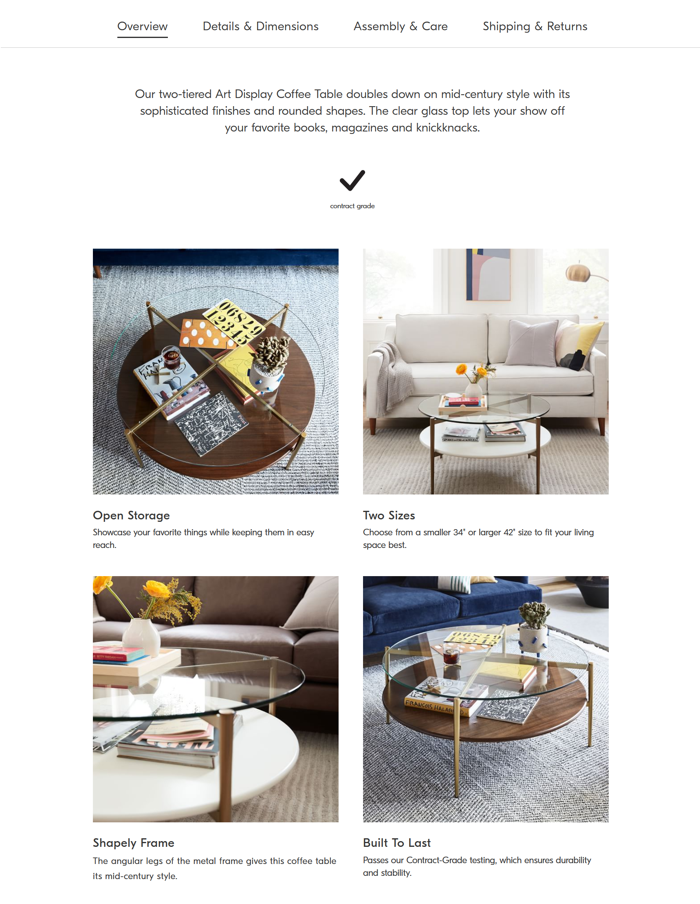
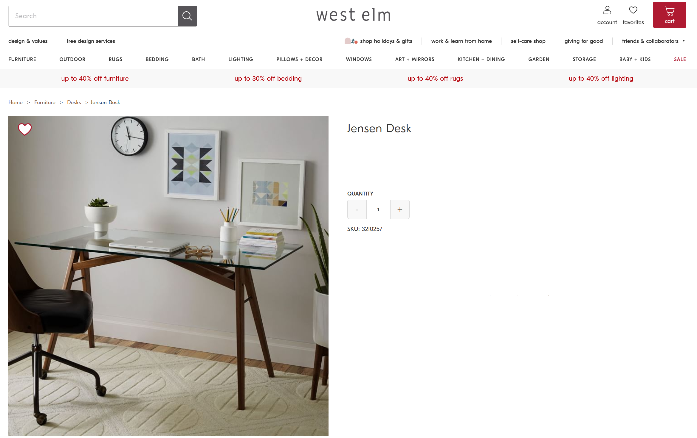
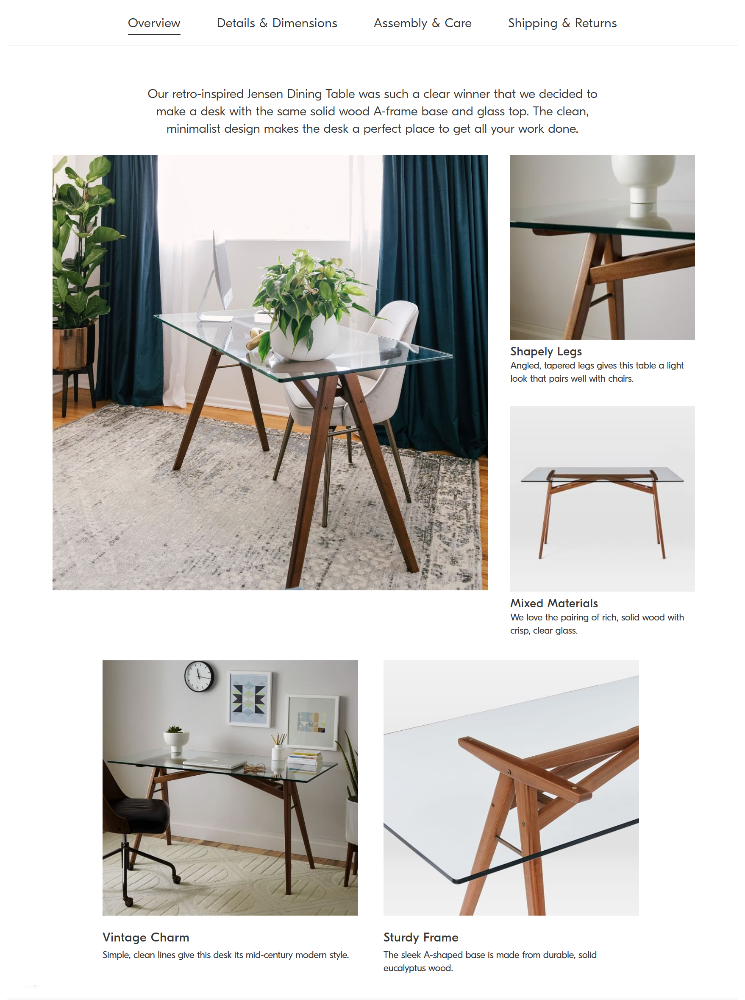
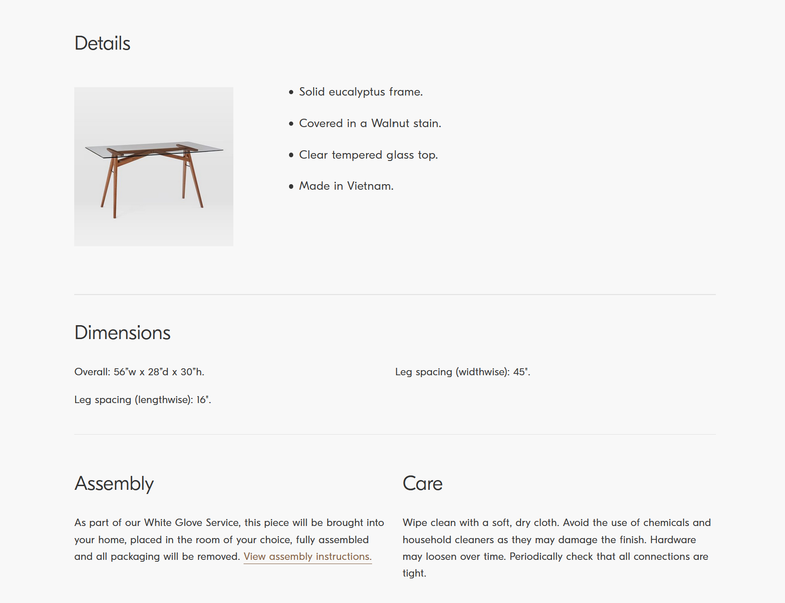
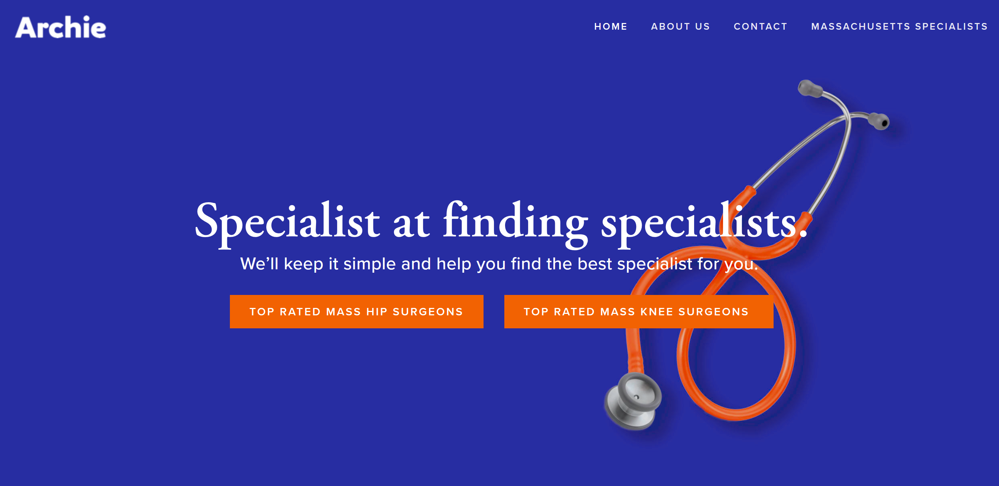
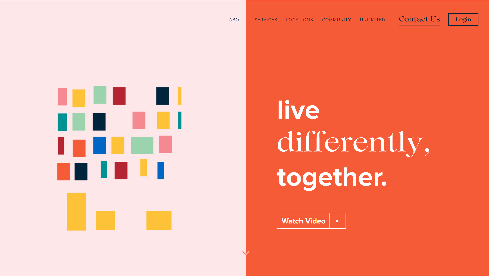
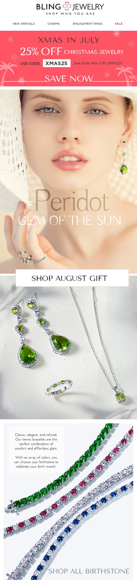
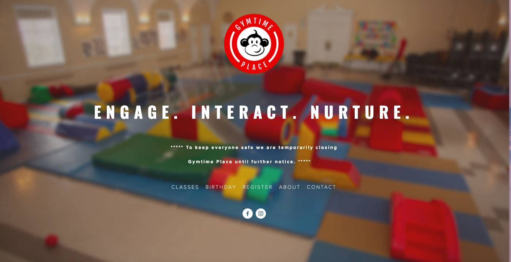
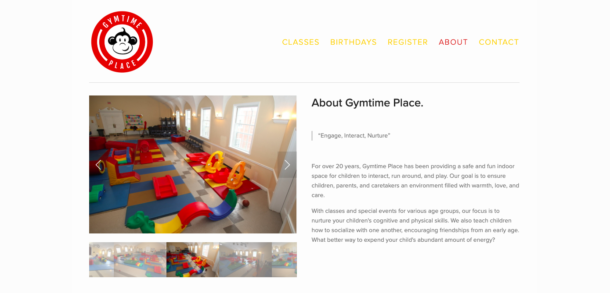

Greetings and salutations! My name is Min and I’m a copywriter who likes to tsk when your I’s are not dotted and your T’s are not crossed. Being detail-oriented is both a blessing and painful, especially when the impulse to cringe towards terrible content or ill use of the semi-colon kicks in. But it comes in awful handy when copywriting and copyediting skills comes in need. I’ve been a copywriter since 2015, working mostly in e-commerce industries and occasional dabbles in agencies. I love utilizing the English vernacular in order to channel creativity and working collaboratively with various teams in order to accomplish something amazing. Check out some of my work and feel free to ask me any questions at min.jung.kim18@gmail.com.

 

# Product Copy
E-Commerce is an ever-changing industry that is continuously growing. Billions of products are sold online every single day. But the difference in sellable and non sellable merchandise can be benefitted by good product descriptions that include SEO rich keywords.

### Active Listings

[Product Page](https://www.westelm.com/products/mid-century-art-display-round-coffee-table-cloud-h4475/)

[Product Page](https://www.westelm.com/products/jensen-desk-h1694/)

[Product Page](https://sothebyshome.com/yoshiaki-ito-yosegi-stool-sea-63536-52484.html#)

[Product Page](https://sothebyshome.com/poliform-long-island-05-sofa-and-service-tables-sea-58946-47687.html)

***

# Branding Copy
Kickstarting or rebranding your company is always challenging. But it’s an exciting opportunity for creatives to collaborate and develop wonderful content. A brand definitely needs a voice - a core visual that will let your audience understand who you are and what your brand represents. Great copywriting can shape the brand and give it life. I’ve had the privilege to work with great teams to help brainstorm and write content for various clients, anywhere from taglines to web copy.

### Previous Clients
- [Archie](https://www.callarchie.com/)

- [Layers](https://layerslife.com/)

***

# Email Copy
Congratulations! You’ve gotten your clients to sign up to receive daily emails that are going to bombard their inbox. Or perhaps it was just the fun and witty content that came with the promotion notifications. No matter what kind of tone you want the writing to convey, smart writing can increase a person back to your webpage.

***

# Website Copy
There are many factors that go into a great website such as an user-friendly interface, visually appealing graphics, and of course great content. No matter what type of voice you want to channel for your page, I can be the writing chameleon that will adopt engaging copy that will entice the reader to stay and enjoy the information.

